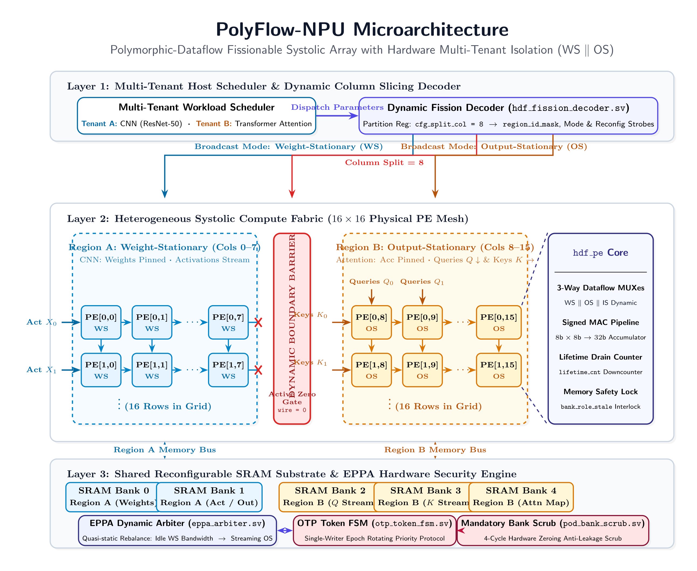

# PolyFlow-NPU: Polymorphic-Dataflow Fissionable Systolic Array
### *Concurrent Multi-Tenant Architecture with Independent Per-Region Dataflows*

---

## 1. Executive Summary & Core Novel Idea

Modern deep learning workloads in autonomous systems, robotics, and datacenter serving increasingly demand **spatial multi-tenancy** (running multiple models concurrently) alongside **multi-modal workload heterogeneity** (running CNN backbones, Transformer Self-Attention, and Depthwise convolutions simultaneously).

### The Fundamental Literature Gap
Prior deep learning accelerators force a mutually exclusive architectural compromise:
1. **Homogeneous Spatial Fission (e.g., Planaria, MICRO'20):** Dynamically partitions the physical systolic array into sub-arrays for concurrent multi-tenancy, but **locks all partitions to a single, rigid dataflow—predominantly Weight-Stationary (WS)**. When a partition executes a Transformer Self-Attention layer ($Q \cdot K^T$), it suffers severe energy and memory traffic overhead because WS is mathematically ill-suited for transient activation-activation multiplications.
2. **Single-Tenant Dataflow Switching (e.g., ReDas, IEEE TC'24):** Allows runtime switching across Weight-Stationary (WS), Output-Stationary (OS), and Input-Stationary (IS), but **operates exclusively on a single tenant across the entire physical array**. Multi-model workloads must queue serially, causing Head-of-Line (HoL) blocking and poor hardware utilization on small-to-medium models.

### Our Solution: Heterogeneous Fission (PolyFlow-NPU)
PolyFlow-NPU unifies both paradigms for the first time:
$$\textbf{PolyFlow-NPU} = \textbf{Concurrent Spatial Multi-Tenancy} + \textbf{Independent Per-Region Polymorphic Dataflow Selection}$$

Each dynamically partitioned region independently selects its mathematically optimal dataflow at runtime:
- **Region A:** Executes a CNN backbone (ResNet/ConvNeXt) in **Weight-Stationary (WS)** mode.
- **Region B:** Concurrently executes Transformer Self-Attention in **Output-Stationary (OS)** mode on the exact same clock cycles.
- **Hardware Isolation & Memory Safety:** Enforced via dynamic systolic boundary zeroing, an Event-Driven Phase-Pinned Arbiter (**EPPA**) that shifts idle bandwidth to streaming tenants, and a **4-cycle mandatory zeroing scrub** with decentralized single-writer ownership tokens (**OTP**).

---

## 2. The Three Architectural Exploration Models

To isolate, evaluate, and benchmark each contribution systematically, this repository provides three self-contained models:

| Model Folder | Architectural Configuration | Multi-Tenancy | Per-Region Dataflow | Key Workload Fit |
|---|---|:---:|:---:|---|
| [**`models/dataflow_switching/`**](file:///root/research/mt_npu/models/dataflow_switching) | **Configuration B**<br/>*(ReDas Baseline)* | Single Tenant Only | Global WS ⇄ OS ⇄ IS | Single-model sequential layer execution |
| [**`models/spatial_fission/`**](file:///root/research/mt_npu/models/spatial_fission) | **Configuration A**<br/>*(Planaria Baseline)* | Multi-Tenant (Region A + B) | Rigidly Locked to WS | Concurrent CNN workloads |
| [**`models/heterogeneous_fission/`**](file:///root/research/mt_npu/models/heterogeneous_fission) | **Configuration C**<br/>*(Novel Proposed Idea)* | **Multi-Tenant (Region A + B)** | **Independent Runtime WS / OS / IS** | **Simultaneous CNN (WS) + Transformer (OS) co-execution** |

---

## 3. Repository Directory Structure

```
mt_npu/
├── figures/                              # Publication-grade architectural diagrams (PNG)
│   ├── polyflow_arch.png                 # Master PolyFlow-NPU architecture diagram (300 dpi)
│   ├── fig0_comparison.png               # Side-by-side taxonomy & comparative matrix
│   ├── figA_homo_fission.png             # Configuration A: Homogeneous Fission Pod
│   ├── figB_seq_switch.png               # Configuration B: Sequential Dataflow Switching Pod
│   └── figC_hetero_fission.png           # Configuration C: Heterogeneous Fission Pod
│
├── models/                               # Self-contained architectural models
│   ├── dataflow_switching/               # [Model 1] Single-tenant runtime switching
│   │   ├── rtl/                          # Hardware RTL (dfs_pe, dfs_array, dfs_top)
│   │   ├── tb/                           # Standalone SystemVerilog testbench (dfs_top_tb.sv)
│   │   ├── dfs_top.sdc                   # SDC timing constraints (1.0 GHz target)
│   │   ├── synth_dfs.tcl                 # Cadence Genus synthesis TCL script
│   │   ├── Makefile                      # Cadence Xcelium simulation & Genus synthesis Makefile
│   │   ├── architecture.md               # Detailed microarchitecture specification
│   │   └── README.md                     # Model-specific guide
│   │
│   ├── spatial_fission/                  # [Model 2] Homogeneous spatial multi-tenancy
│   │   ├── rtl/                          # Hardware RTL (sfa_pe, sfa_array, sfa_fission_dec, sfa_eppa, etc.)
│   │   ├── tb/                           # Standalone SystemVerilog testbench (sfa_top_tb.sv)
│   │   ├── sfa_top.sdc                   # SDC timing constraints (1.0 GHz target)
│   │   ├── synth_sfa.tcl                 # Cadence Genus synthesis TCL script
│   │   ├── Makefile                      # Cadence Xcelium simulation & Genus synthesis Makefile
│   │   ├── architecture.md               # Detailed microarchitecture specification
│   │   └── README.md                     # Model-specific guide
│   │
│   └── heterogeneous_fission/            # [Model 3] Novel Heterogeneous Fission (PolyFlow-NPU)
│       ├── rtl/                          # Hardware RTL (hdf_pe, hdf_array_grid, hdf_fission_dec, etc.)
│       ├── tb/                           # Standalone SystemVerilog testbench (hdf_top_tb.sv)
│       ├── hdf_top.sdc                   # SDC timing constraints (1.0 GHz target)
│       ├── synth_hdf.tcl                 # Cadence Genus synthesis TCL script
│       ├── Makefile                      # Cadence Xcelium simulation & Genus synthesis Makefile
│       ├── architecture.md               # Detailed microarchitecture specification
│       └── README.md                     # Model-specific guide
│
├── scripts/
│   └── run_all_models.sh                 # Unified testbench runner for Verilator and Icarus Verilog
│
├── local/                                # Local working references & baseline specs (gitignored)
├── .gitignore                            # Ignores build artifacts and local/ directory
└── README.md                             # Repository root documentation (this file)
```

---

## 4. Key Hardware Subsystems & Invariants

<p align="center">
  
</p>

1. **Heterogeneous PE (`hdf_pe.sv`):** Unifies 3-way runtime operand multiplexing (WS/OS/IS) with an in-flight **lifetime countdown counter** (`lifetime_cnt`) that gracefully drains partial sums during partition re-sizing, and a **bank role stale flag** (`bank_role_stale`) protecting against stale memory reads. Includes operand clamping and zero-detection sparsity gating for dynamic power reduction.
2. **Dynamic Boundary Barrier (`hdf_array_grid.sv`):** Slices the 2D mesh at `cfg_split_col`. Wires crossing the boundary are actively zeroed to guarantee **provable zero cross-talk** between tenants.
3. **Event-Driven Phase-Pinned Arbiter (EPPA, `eppa_arbiter.sv`):** Reallocates memory bandwidth upon phase transitions (`BURST`, `STREAM`, `IDLE`, `RECONFIG`). When Region A enters steady-state compute, its idle bandwidth automatically shifts to Region B's streaming query/key buffers.
4. **Decentralized Single-Writer Tokens (OTP, `otp_token_fsm.sv`) & 4-Cycle Scrub (`pod_bank_scrub.sv`):** Epoch-rotating priority guarantees starvation-free memory access, while a mandatory 4-cycle hardware zeroing scrub wipes residual tenant weights before memory release, eliminating side-channel data-retention attacks.

---

## 5. Dedicated Model Makefile Usage Guide

Each of the three architectural exploration models is completely self-contained with its own dedicated [`Makefile`](file:///root/research/mt_npu/models/heterogeneous_fission/Makefile) located inside its respective directory:
* [**`models/dataflow_switching/Makefile`**](file:///root/research/mt_npu/models/dataflow_switching/Makefile)
* [**`models/spatial_fission/Makefile`**](file:///root/research/mt_npu/models/spatial_fission/Makefile)
* [**`models/heterogeneous_fission/Makefile`**](file:///root/research/mt_npu/models/heterogeneous_fission/Makefile)

---

### 5.1 Standard Targets Available in Each Model

Navigate into any model directory (`cd models/<model_name>`) and run:

| Target | Description | Options |
| :--- | :--- | :--- |
| `make lint-verilator` | Run strict Verilator linting (`--lint-only -Wall`) on the model's RTL and TB | Strict `-Wall`, `--timing` |
| `make lint-cadence` | Run Cadence HAL linting on the model's RTL and TB | Cadence environment |
| `make lint` | Run default lint check (aliases to `lint-verilator`) | — |
| `make run` | Launch Cadence Xcelium (`xrun`) simulation with SimVision GUI | `GUI=1` (Default) |
| `make run GUI=0` | Run Cadence Xcelium (`xrun`) simulation in headless batch mode | Batch / CI mode |
| `make synth` | Run Cadence Genus ASIC logic synthesis mapped to target library (`slow.lib`) | Generates netlist & reports |
| `make clean` | Clean up all simulation sandboxes, waveform databases (`waves.shm`), and reports | Full model cleanup |
| `make help` | Display interactive target help menu | — |

---

### 5.2 Step-by-Step Usage per Model

#### Model 1: Single-Tenant Dataflow Switching
```bash
cd models/dataflow_switching

# 1. Lint checks (Verilator or Cadence HAL):
make lint-verilator # Strict Verilator -Wall lint
make lint-cadence   # Cadence HAL lint

# 2. Simulate with Cadence Xcelium (interactive GUI or batch):
make run GUI=1      # SimVision GUI
make run GUI=0      # Command-line batch

# 3. Synthesize with Cadence Genus:
make synth          # Produces timing_dfs.rpt, area_dfs.rpt, power_dfs.rpt, and dfs_top_netlist.v

# 4. Clean artifacts:
make clean
```

#### Model 2: Homogeneous Spatial Fission
```bash
cd models/spatial_fission

# 1. Lint checks (Verilator or Cadence HAL):
make lint-verilator # Strict Verilator -Wall lint
make lint-cadence   # Cadence HAL lint

# 2. Simulate with Cadence Xcelium:
make run GUI=1      # SimVision GUI
make run GUI=0      # Command-line batch

# 3. Synthesize with Cadence Genus:
make synth          # Produces timing_sfa.rpt, area_sfa.rpt, power_sfa.rpt, and sfa_top_netlist.v

# 4. Clean artifacts:
make clean
```

#### Model 3: Heterogeneous Fission (PolyFlow-NPU)
```bash
cd models/heterogeneous_fission

# 1. Lint checks (Verilator or Cadence HAL):
make lint-verilator # Strict Verilator -Wall lint
make lint-cadence   # Cadence HAL lint

# 2. Simulate with Cadence Xcelium:
make run GUI=1      # SimVision GUI
make run GUI=0      # Command-line batch

# 3. Synthesize with Cadence Genus:
make synth          # Produces timing_hdf.rpt, area_hdf.rpt, power_hdf.rpt, and hdf_top_netlist.v

# 4. Clean artifacts:
make clean
```

---

### 5.3 Batch Multi-Model Simulation Script (Verilator & Icarus)
If you wish to simulate all three models sequentially from the repository root without entering each folder:
```bash
# High-speed native simulation with Verilator:
./scripts/run_all_models.sh verilator

# Event-driven simulation with Icarus Verilog:
./scripts/run_all_models.sh iverilog
```
