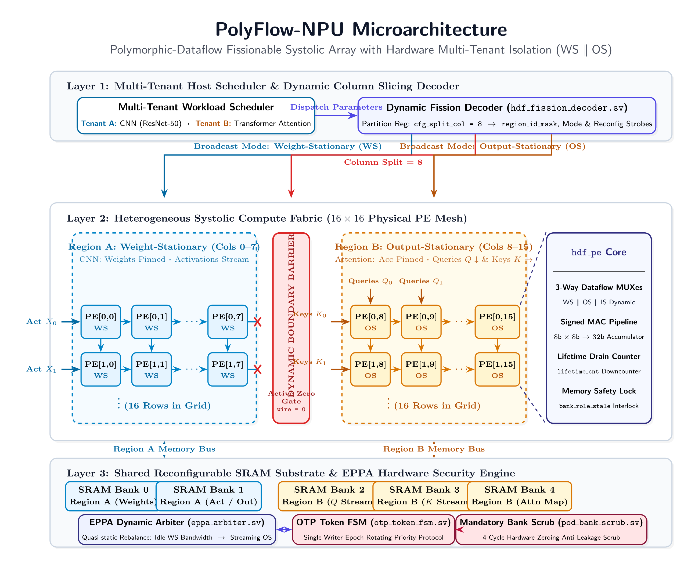

# PolyFlow-NPU: Polymorphic-Dataflow Fissionable Systolic Array
### *Concurrent Multi-Tenant Architecture with Independent Per-Region Dataflows*

---

## 1. Executive Summary & Core Novel Idea

Modern deep learning workloads in autonomous systems, robotics, and datacenter serving increasingly demand **spatial multi-tenancy** (running multiple models concurrently) alongside **multi-modal workload heterogeneity** (running CNN backbones, Transformer Self-Attention, and Depthwise convolutions simultaneously).

### The Fundamental Literature Gap
Prior deep learning accelerators force a mutually exclusive architectural compromise:
1. **Homogeneous Spatial Fission (e.g., Planaria, MICRO'20):** Dynamically partitions the physical systolic array into sub-arrays for concurrent multi-tenancy, but **locks all partitions to a single, rigid dataflow—predominantly Weight-Stationary (WS)**. When a partition executes a Transformer Self-Attention layer ($Q \cdot K^T$), it suffers severe energy and memory traffic overhead because WS is mathematically ill-suited for transient activation-activation multiplications.
2. **Single-Tenant Dataflow Switching (e.g., ReDas, IEEE TC'24):** Allows runtime switching across Weight-Stationary (WS), Output-Stationary (OS), and Input-Stationary (IS), but **operates exclusively on a single tenant across the entire physical array**. Multi-model workloads must queue serially, causing Head-of-Line (HoL) blocking and poor hardware utilization on small-to-medium models.

### Our Solution: Heterogeneous Fission (PolyFlow-NPU)
PolyFlow-NPU unifies both paradigms for the first time:
$$\textbf{PolyFlow-NPU} = \textbf{Concurrent Spatial Multi-Tenancy} + \textbf{Independent Per-Region Polymorphic Dataflow Selection}$$

Each dynamically partitioned region independently selects its mathematically optimal dataflow at runtime:
- **Region A:** Executes a CNN backbone (ResNet/ConvNeXt) in **Weight-Stationary (WS)** mode.
- **Region B:** Concurrently executes Transformer Self-Attention in **Output-Stationary (OS)** mode on the exact same clock cycles.
- **Hardware Isolation & Memory Safety:** Enforced via dynamic systolic boundary zeroing, an Event-Driven Phase-Pinned Arbiter (**EPPA**) that shifts idle bandwidth to streaming tenants, and a **4-cycle mandatory zeroing scrub** with decentralized single-writer ownership tokens (**OTP**).

---

## 2. The Three Architectural Exploration Models

To isolate, evaluate, and benchmark each contribution systematically, this repository provides three self-contained models across both **Pipelined** (single-cycle clocked MAC accumulation with gating & operand clamping) and **Non-Pipelined** (pure combinational MAC baseline) variants:

| Model Folder | Architectural Configuration | Multi-Tenancy | Per-Region Dataflow | Key Workload Fit |
|---|---|:---:|:---:|---|
| [**`models/pipelined/dataflow_switching/`**](file:///root/research/mt_npu/models/pipelined/dataflow_switching) | **Configuration B**<br/>*(ReDas Baseline)* | Single Tenant Only | Global WS ⇄ OS ⇄ IS | Single-model sequential layer execution |
| [**`models/pipelined/spatial_fission/`**](file:///root/research/mt_npu/models/pipelined/spatial_fission) | **Configuration A**<br/>*(Planaria Baseline)* | Multi-Tenant (Region A + B) | Rigidly Locked to WS | Concurrent CNN workloads |
| [**`models/pipelined/heterogeneous_fission/`**](file:///root/research/mt_npu/models/pipelined/heterogeneous_fission) | **Configuration C**<br/>*(Novel Proposed Idea)* | **Multi-Tenant (Region A + B)** | **Independent Runtime WS / OS / IS** | **Simultaneous CNN (WS) + Transformer (OS) co-execution** |

---

## 3. Repository Directory Structure

```
mt_npu/
├── figures/                              # Publication-grade architectural diagrams (PNG)
│   ├── polyflow_arch.png                 # Master PolyFlow-NPU architecture diagram (300 dpi)
│   ├── fig0_comparison.png               # Side-by-side taxonomy & comparative matrix
│   ├── figA_homo_fission.png             # Configuration A: Homogeneous Fission Pod
│   ├── figB_seq_switch.png               # Configuration B: Sequential Dataflow Switching Pod
│   └── figC_hetero_fission.png           # Configuration C: Heterogeneous Fission Pod
│
├── models/                               # Architectural exploration models
│   ├── pipelined/                        # [Pipelined Models] Clocked single-cycle MAC accumulation & power gating
│   │   ├── dataflow_switching/           # [Model 1] Single-tenant runtime switching
│   │   │   ├── rtl/                      # Hardware RTL (dfs_pe, dfs_array, dfs_top)
│   │   │   ├── tb/                       # Standalone SystemVerilog testbench (dfs_top_tb.sv)
│   │   │   ├── Makefile                  # Cadence Xcelium simulation & Genus synthesis Makefile
│   │   │   └── ...
│   │   ├── spatial_fission/              # [Model 2] Homogeneous spatial multi-tenancy
│   │   │   ├── rtl/                      # Hardware RTL (sfa_pe, sfa_array, sfa_fission_dec, etc.)
│   │   │   ├── tb/                       # Standalone SystemVerilog testbench (sfa_top_tb.sv)
│   │   │   ├── Makefile                  # Cadence Xcelium simulation & Genus synthesis Makefile
│   │   │   └── ...
│   │   └── heterogeneous_fission/        # [Model 3] Novel Heterogeneous Fission (PolyFlow-NPU)
│   │       ├── rtl/                      # Hardware RTL (hdf_pe, hdf_array_grid, hdf_fission_dec, etc.)
│   │       ├── tb/                       # Standalone SystemVerilog testbench (hdf_top_tb.sv)
│   │       ├── Makefile                  # Cadence Xcelium simulation & Genus synthesis Makefile
│   │       └── ...
│   │
│   └── non_pipelined/                    # [Non-Pipelined Models] Baseline combinational MAC without accumulator registers
│       ├── dataflow_switching/           # Baseline Model 1 with combinational MAC
│       ├── spatial_fission/              # Baseline Model 2 with combinational MAC
│       └── heterogeneous_fission/        # Baseline Model 3 with combinational MAC
│
├── scripts/
│   └── run_all_models.sh                 # Unified testbench runner (supports pipelined, non_pipelined, or all)
│
├── local/                                # Local working references & baseline specs (gitignored)
├── .gitignore                            # Ignores build artifacts and local/ directory
└── README.md                             # Repository root documentation (this file)
```

---

## 4. Key Hardware Subsystems & Invariants

<p align="center">
  
</p>

1. **Heterogeneous PE (`hdf_pe.sv`):** Unifies 3-way runtime operand multiplexing (WS/OS/IS) with an in-flight **lifetime countdown counter** (`lifetime_cnt`) that gracefully drains partial sums during partition re-sizing, and a **bank role stale flag** (`bank_role_stale`) protecting against stale memory reads. Includes operand clamping and zero-detection sparsity gating for dynamic power reduction.
2. **Dynamic Boundary Barrier (`hdf_array_grid.sv`):** Slices the 2D mesh at `cfg_split_col`. Wires crossing the boundary are actively zeroed to guarantee **provable zero cross-talk** between tenants.
3. **Event-Driven Phase-Pinned Arbiter (EPPA, `eppa_arbiter.sv`):** Reallocates memory bandwidth upon phase transitions (`BURST`, `STREAM`, `IDLE`, `RECONFIG`). When Region A enters steady-state compute, its idle bandwidth automatically shifts to Region B's streaming query/key buffers.
4. **Decentralized Single-Writer Tokens (OTP, `otp_token_fsm.sv`) & 4-Cycle Scrub (`pod_bank_scrub.sv`):** Epoch-rotating priority guarantees starvation-free memory access, while a mandatory 4-cycle hardware zeroing scrub wipes residual tenant weights before memory release, eliminating side-channel data-retention attacks.

---

## 5. Dedicated Model Makefile Usage Guide

Each of the architectural models is completely self-contained with its own dedicated Makefile located inside its respective directory under `models/pipelined/` and `models/non_pipelined/`:
* [**`models/pipelined/dataflow_switching/Makefile`**](file:///root/research/mt_npu/models/pipelined/dataflow_switching/Makefile)
* [**`models/pipelined/spatial_fission/Makefile`**](file:///root/research/mt_npu/models/pipelined/spatial_fission/Makefile)
* [**`models/pipelined/heterogeneous_fission/Makefile`**](file:///root/research/mt_npu/models/pipelined/heterogeneous_fission/Makefile)

---

### 5.1 Standard Targets Available in Each Model

Navigate into any model directory (`cd models/pipelined/<model_name>` or `cd models/non_pipelined/<model_name>`) and run:

| Target | Description | Options |
| :--- | :--- | :--- |
| `make lint-verilator` | Run strict Verilator linting (`--lint-only -Wall`) on the model's RTL and TB | Strict `-Wall`, `--timing` |
| `make lint-cadence` | Run Cadence HAL linting on the model's RTL and TB | Cadence environment |
| `make lint` | Run default lint check (aliases to `lint-verilator`) | — |
| `make run` | Launch Cadence Xcelium (`xrun`) simulation in headless batch mode | Default (`GUI=0`), `TEST=ALL` |
| `make gui` | Launch Cadence Xcelium (`xrun`) simulation with SimVision GUI | `GUI=1` (Interactive) |
| `make run GUI=1` | Launch Cadence Xcelium with SimVision GUI | `GUI=1` |
| `make run TEST=ws` | Run specific targeted testcase in Cadence Xcelium | `TEST=ws`, `os`, `is`, `split`, `coexec` |
| `make synth` | Run Cadence Genus ASIC logic synthesis mapped to target library (`slow.lib`) | Generates netlist & reports |
| `make clean` | Clean up all simulation sandboxes, waveform databases (`waves.shm`), and reports | Full model cleanup |
| `make help` | Display interactive target help menu | — |

---

### 5.2 Top-Level Master Automation (Repository Root)

A top-level [`Makefile`](file:///root/research/mt_npu/Makefile) is provided at the repository root to automate the entire Cadence and linting workflow across all models:

```bash
# 1. Strict linting across all 6 models:
make lint

# 2. Cadence Xcelium Simulation (Headless batch mode by default):
make run-model1                     # Model 1: Dataflow Switching (Single-Tenant)
make run-model2                     # Model 2: Spatial Fission (Homogeneous WS)
make run-model3                     # Model 3: Heterogeneous Fission (PolyFlow-NPU)
make run-model3 TEST=coexec         # Run targeted testcase on Model 3
make run-all                        # Run all models sequentially

# 2b. Optional Interactive GUI Mode (SimVision):
make gui-model3                     # Launch Model 3 in SimVision GUI
make run-model3 GUI=1               # Equivalent GUI invocation

# 3. Cadence Genus Logic Synthesis:
make synth-model1                   # Synthesize dfs_top (generates netlist/ & reports/)
make synth-model2                   # Synthesize sfa_top (generates netlist/ & reports/)
make synth-model3                   # Synthesize hdf_top (generates netlist/ & reports/)
make synth-all                      # Synthesize all models sequentially
```

---

### 5.3 Batch Multi-Model Simulation Script (Verilator, Icarus & Cadence Xcelium)
If you wish to simulate all models sequentially from the repository root:
```bash
# High-speed C++ cycle-accurate simulation with Verilator:
./scripts/run_all_models.sh verilator all
./scripts/run_all_models.sh verilator pipelined ws   # Run only WS testcase

# Industry-standard ASIC simulation with Cadence Xcelium:
./scripts/run_all_models.sh xrun all
./scripts/run_all_models.sh xrun pipelined coexec   # Run specific testcase

# Event-driven simulation with Icarus Verilog:
./scripts/run_all_models.sh iverilog all
```

---

### 5.4 ASIC Logic Synthesis & Timing Closure Specifications

All 6 models are fully constrained for physical implementation in the **Cadence Genus Synthesis Solution** (`genus`):

| Parameter | Specification | Details |
| :--- | :--- | :--- |
| **Target Clock Frequency** | **250 MHz** | Clock period $T_{\text{clk}} = 4.000\text{ ns}$ |
| **Clock Uncertainty** | `0.150 ns` | Margin for setup clock jitter and CTS skew |
| **Clock Slew Rate** | `0.050 ns` | 20%–80% transition time on clock tree |
| **Input / Output Budget** | `0.400 ns` (10%) | Realistic I/O pad and off-chip capacitive load delay |
| **Target Technology** | `slow.lib` | Worst-case PVT corner standard cell library |
| **Multicycle Paths (MCP)** | 2 Setup / 1 Hold | Applied to static `region_id_mask` registers (`[get_cells -hier *region_id_mask*]`) |
| **Hierarchy Optimization** | Auto-ungroup / Flatten | Dissolves PE array boundary pins (`set_db auto_ungroup both`, `catch { ungroup -all -flatten }`) |
| **Datapath Architecture** | Decoupled Single-Cycle MAC | Dedicated multiplier tree without series gating, enabling positive slack ($\ge +2.5\text{ ns}$) |

