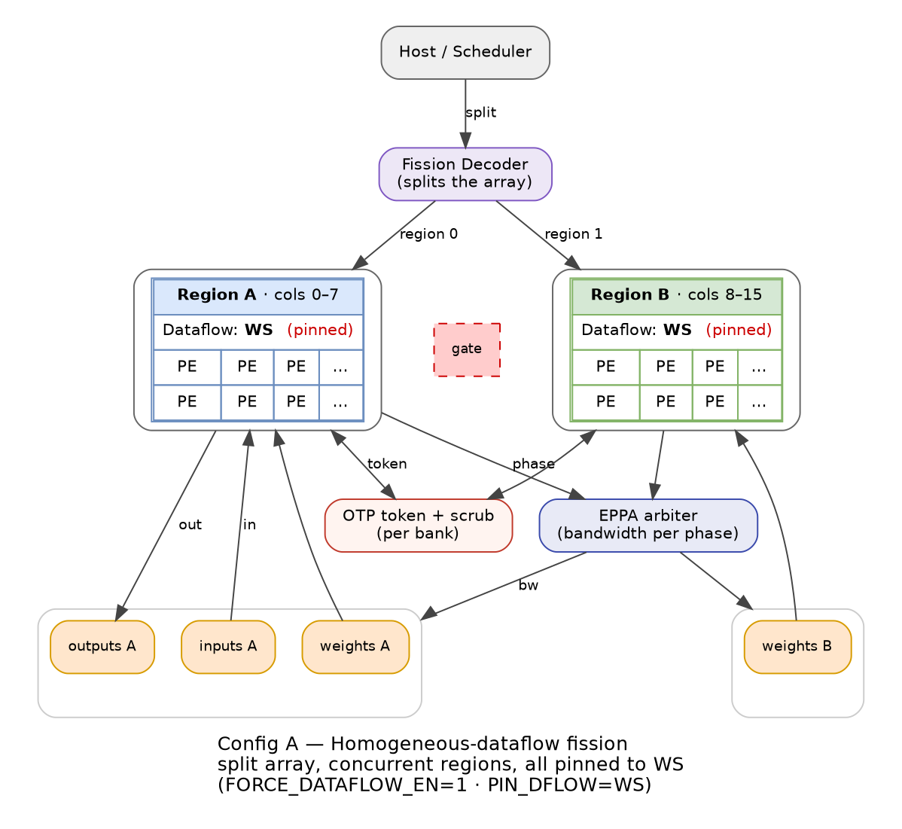
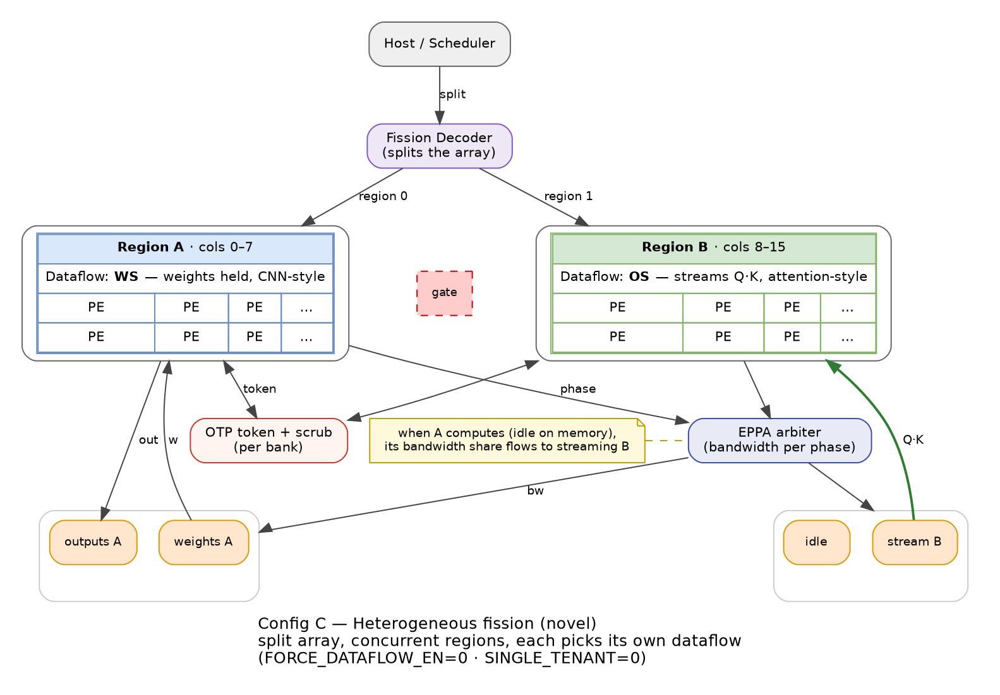

# DRDS-NPU Baseline Architecture — Part 2: Runtime Dataflow Switching (HDF-PE + EPPA)

**Document status:** Baseline specification (Stage 1)
**Companion document:** `fission_baseline.md` (spatial fission + ownership safety)

---

## Table of Contents

1. [Scope](#1-scope)
2. [The Three Dataflows](#2-the-three-dataflows)
3. [HDF-PE Microarchitecture](#3-hdf-pe-microarchitecture)
4. [Mode Mappings on the Mesh](#4-mode-mappings-on-the-mesh)
5. [Compute Windowing — Lifetime Counter & Stale Flag](#5-compute-windowing--lifetime-counter--stale-flag)
6. [Memory Phase Profiles](#6-memory-phase-profiles)
7. [EPPA — Event-Driven Phase-Pinned Arbiter](#7-eppa--event-driven-phase-pinned-arbiter)
8. [Worked Example — Heterogeneous Co-Execution](#8-worked-example--heterogeneous-co-execution)
9. [Interface Reference](#9-interface-reference)
10. [Parameter Defaults](#10-parameter-defaults)
11. [Verification Checklist](#11-verification-checklist)

---

## 1. Scope

This document specifies how a **region** of the DRDS-NPU pod computes: the
Processing Element datapath with runtime-selectable Weight-/Output-/Input-
Stationary dataflow, the arithmetic contract, and the Event-driven Phase-
Pinned Arbiter (EPPA) that reconciles the very different memory-bandwidth
profiles those dataflows produce.

Partitioning mechanics, boundary isolation, and bank ownership are specified
in `fission_baseline.md`. This document assumes a region already exists (a
contiguous column span with a stable `region_id`) and describes what happens
inside it.

> **Deliberate deviations from the draft RTL** (agreed design decisions):
> 1. The MAC is now **functional**, not structural: signed int8 multiply,
>    single product per cycle (`acc += stat_operand × stream_operand`),
>    accumulator widened to `ACC_W = 32` (the draft's `2×DATA_W = 16` bits
>    overflows after ~256 accumulations).
> 2. Output routing no longer broadcasts truncated accumulator bits on every
>    enabled port; drains are deterministic per §4.
> 3. EPPA keeps the draft's event-pinned scheme verbatim; its known
>    oversubscription property is documented (§7.4) rather than silently
>    inherited.

---

## 2. The Three Dataflows

A systolic PE must choose which operand, if any, stays resident. DRDS-NPU
makes that choice a **runtime register field per region**, not a fabrication-
time property:

| Encoding | Dataflow | Stationary operand | Best suited for | Why |
|---|---|---|---|---|
| `2'b00` | **WS** — Weight-Stationary | Filter weight | Conv, FC | Weights reused across the whole tile: load once, stream activations through |
| `2'b01` | **OS** — Output-Stationary | None (accumulator holds the output) | Attention `Q·Kᵀ`, `softmax·V` | Both operands are live activations; neither deserves residency, the partial sum does |
| `2'b10` | **IS** — Input-Stationary | Input activation | Depthwise/separable conv | One activation fan-outs to many filter taps: hold it, stream weights |
| `2'b11` | Reserved | — | Power-gated idle | No MAC issued |

The motivating asymmetry: Planaria-style multitasking forces every region into
WS, so a co-resident transformer runs in the wrong dataflow; ReDas switches
dataflows but is single-tenant. DRDS-NPU's contribution layer is precisely the
combination — each region picks its optimum (this document) while sharing one
physical substrate safely (`fission_baseline.md`).

---

## 3. HDF-PE Microarchitecture

### 3.1 Block diagram

```
            din_n ▲  │ dout_n            ┌────────────────────────────┐
                  │  ▼                   │  stat_operand  (DATA_W)    │
            ┌───────────┐   route_sel   │  operand_a/b    (DATA_W)   │
 din_w ────►│ Input     │──────────────►│  ┌──────────┐  mac_acc     │
 dout_w ◄───│ crossbar  │               │  │ signed   │  (ACC_W=32)  │
            │ + mode    │──────────────►│  │ MAC:     │◄─── lifetime │
 din_e ────►│ muxes     │               │  │ acc +=   │      gate    │
 dout_e ◄───│           │──────────────►│  │ a×b      │              │
            └───────────┘               │  └──────────┘              │
            din_s ▲  │ dout_s           └────────────────────────────┘
                  │  ▼                      │
              (N/S/E/W mesh edges)     bank_role_stale / clear handshake
```

### 3.2 Arithmetic contract

| Item | Contract |
|---|---|
| Operand width | `DATA_W = 8`, **two's complement signed** (int8) |
| Multiplication | `$signed(a) * $signed(b)`, one product per cycle |
| Accumulation | `mac_acc <= mac_acc + stat_operand * stream_operand` |
| Accumulator | `ACC_W = 32` bits, saturate-free wrap (software guarantees headroom) |
| Clearing | `mac_acc` cleared by `acc_clr` at tile boundaries and on `region_reassign` |
| Enable | MAC issues only while `mac_en` (see §5) |

Per-cycle product is 16 bits; worst-case accumulation growth for a 32-length
K-dimension needs 16 + ⌈log2 32⌉ = 21 bits — `ACC_W = 32` leaves comfortable
headroom for tiled accumulation without per-tile rescale.

### 3.3 Input crossbar and `route_sel`

Each incoming mesh edge feeds a `route_sel`-gated mux:

```
op_in_n = route_sel[3] ? din_n : 8'sd0     // North enable
op_in_s = route_sel[2] ? din_s : 8'sd0     // South enable
op_in_e = route_sel[1] ? din_e : 8'sd0     // East enable
op_in_w = route_sel[0] ? din_w : 8'sd0     // West enable
```

Disabled edges contribute signed zero (never garbage), so mode transitions
cannot inject stale wire values into the MAC. The mode-dependent assignment of
`op_in_*` to `{stat_operand, stream_operand}` is given in §4.

### 3.4 Reserved mode

`dataflow_mode = 2'b11` forces both MAC inputs to zero and is intended for
clock/power gating. It is structurally safe (produces zeros) but carries no
performance claim in the baseline.

---

## 4. Mode Mappings on the Mesh

The mesh convention: **eastbound rows** carry the streaming activation/weight
plane; **southbound columns** carry partial-sum drainage; **northbound edges**
carry preloads and output readout; the **west edge** is each region's primary
injection port (per-region injection is what makes fission compatible — see
companion doc §5).

### 4.1 WS — Weight-Stationary (`2'b00`)

```
Preload phase:  weights enter from WEST, one per PE, latched into stat_operand
Stream phase:   activations flow WEST→EAST along each row
Drain phase:    partial sums flow SOUTH column-wise to the output collector

PE:  stat_operand ← w_preload      (held for whole tile)
     mac_acc += stat_operand * op_in_w     // stream_operand = westbound act
     dout_e = op_in_w (row pass-through), dout_s = drain path
```

- Weight preload rides the same west port as the activation stream but in a
  disjoint phase (tile setup), distinguished by `phase_tag = BURST` and a
  `w_ld` strobe from the region controller.
- Row length = region width; the eastmost column of each region forwards into
  that region's collector (or terminates), never across the fission boundary
  (companion doc §5 enforces the gate).

### 4.2 OS — Output-Stationary (`2'b01`)

```
Queries Q flow NORTH→SOUTH down each column
Keys    K flow WEST→EAST along each row
Output element accumulates in-place; readout via SOUTH drain at tile end

PE:  stat_operand unused (= 0)
     mac_acc += op_in_w * op_in_n          // K (westbound) × Q (southbound)
     dout_s = op_in_n pass-through during compute; drain during readout
```

- No preload phase: both planes stream continuously — this is the profile that
  motivates the `STREAM` bandwidth phase (§6).
- The accumulator *is* the stationary object; the tile ends when the column
  index of Q has swept the full K-dimension.

### 4.3 IS — Input-Stationary (`2'b10`)

```
Preload phase:  input activations enter from NORTH, latched into stat_operand
Stream phase:   weights flow WEST→EAST along each row
Drain phase:    partial sums flow SOUTH

PE:  stat_operand ← act_preload
     mac_acc += stat_operand * op_in_w     // stream_operand = westbound weight
     dout_e = op_in_w (pass-through), dout_s = drain path
```

Structurally identical to WS with the roles of the two planes swapped and the
preload arriving from the north edge.

### 4.4 Summary table

| Mode | `stat_operand` src | `stream_operand` src | Preload port | Continuous streams | Drain |
|---|---|---|---|---|---|
| WS `00` | West preload | West (activations) | West | Eastbound rows | South |
| OS `01` | — | West (K) + North (Q) | none | Rows + columns | South (end of tile) |
| IS `10` | North preload | West (weights) | North | Eastbound rows | South |
| RSV `11` | 0 | 0 | — | none | — |

Mode switching itself is dispatch-time per tile: `dataflow_mode` is driven by
the region controller and may change between tiles freely (it is a
combinational mux select ahead of the MAC), but not mid-tile. Combined with
dispatch-time fission (companion doc §2.2), every tile launch fixes the
tuple *(region span, dataflow)* — the "region×role contract" the safety
analysis enumerates.

---

## 5. Compute Windowing — Lifetime Counter & Stale Flag

Two PE-level mechanisms connect this document to the fission safety story.

**Lifetime counter (`LIFETIME_W = 4`).** A countdown window loaded via
`lifetime_ld`/`lifetime_init`. While `lifetime_cnt != 0` the PE is enabled
(`mac_en = 1`); at zero, MACs gate off. Uses:

1. **Handover drain** (primary): on `region_reassign`, the region controller
   loads the pipeline depth; the PE finishes exactly the in-flight partial
   sums and stops. Companion doc §4 step 2 consumes this.
2. **Tile pacing** (secondary): a region may cap a tile's active window to
   bound power/thermal, at zero architectural cost.

**Bank-role stale flag.** `bank_role_stale` sets on `region_reassign` and
clears only on `bank_role_clear` (from the acquiring bank's scrub controller).
While set, the PE's memory requests are invalid — compute may continue only
within the lifetime window described above, on operands already inside the
PE. This closes the residual-data hazard at the PE/memory seam; the bank-side
half is companion doc §6.2.

---

## 6. Memory Phase Profiles

The reason a plain round-robin bandwidth arbiter fails here: WS/IS and OS
workloads want bandwidth at *different times*, in *different shapes*.

```
WS/IS tile:    BURST ──────► IDLE ───────────────► BURST ──────►
               preload/drain   stationary compute    next tile

OS tile:       STREAM ─────────────────────────────────────────►
               continuous Q/K feeding, no stationary phase
```

Every region announces its current phase on a 2-bit tag:

| Encoding | Phase | Meaning |
|---|---|---|
| `2'b00` | `BURST` | Preloading weights/inputs, draining psums — needs max bandwidth, briefly |
| `2'b01` | `IDLE` | Stationary compute phase — needs zero bandwidth |
| `2'b10` | `STREAM` | Continuous OS streaming — sustained moderate demand |
| `2'b11` | `RECONFIG` | Tile teardown + setup — max bandwidth, elevated priority |

Role encodings for banks (committed by the scrub controller, consumed by the
region sequencers):

| Encoding | Bank role |
|---|---|
| `2'b00` | Weight-Issuer |
| `2'b01` | Input-Issuer |
| `2'b10` | Output-Receiver |
| `2'b11` | Idle / Scrubbing |

---

## 7. EPPA — Event-Driven Phase-Pinned Arbiter

### 7.1 Principle

EPPA recomputes the bandwidth split **only when some region's phase tag
changes**, pins the result in registers, and does nothing otherwise. There is
no per-cycle arbitration, so arbitration logic sits entirely off the
steady-state critical path; the only clocked work in steady state is a
wide equality compare (`phase_tag != phase_tag_prev`).

### 7.2 Allocation policy (pinned on transition)

| Phase of region `i` | `bw_alloc[i]` (of `BW_W = 8` bits) | Notes |
|---|---|---|
| `BURST` | `0xFF` (full) | Short-lived by construction |
| `IDLE` | `0x00` | Frees the fabric for the other tenant |
| `STREAM` | `0x7F` (half) | Sustained; deliberately throttled |
| `RECONFIG` | `0xFF` (full) + `reconfig_urgent[i] = 1` | Fast-path flag for the scheduler/FQPP consumers |

The complementary pairing is the economic argument: a WS region's IDLE phase
donates its share exactly while a co-resident OS region wants to stream, and
vice versa at WS preload time. EPPA monetizes anti-correlated demand without
ever asking "who wants it more?" per cycle.

### 7.3 Update timing

```
phase_tag[A]:  ──BURST──┬────────IDLE─────────┬──BURST──
phase_tag[B]:  ─STREAM─┬────────STREAM────────┬──...
                       ↑ transition edge (any lane)
bw_alloc:      ══old═══╪═══════new═══════════╪══...     (registered 1 cycle later)
```

One-cycle detection latency, then pinned indefinitely. `reconfig_urgent` is
exported alongside `bw_alloc` so downstream consumers (scheduler priority
logic; the FQPP fast-path bypass in the extended 4-region variant) can react
to reconfiguration events without padding delay.

### 7.4 Known limitation (documented, accepted)

Allocations are **absolute, not normalized**: two simultaneously `BURST`
regions each pin `0xFF`, summing to 200% of fabric bandwidth. The baseline
treats this as the consumer's problem (sequencers run at whatever rate the
fabric actually sustains; correctness is unaffected). Quantified savings of
event-pinning versus static partitioning require workload trace profiling —
open research Gap 1 in the master plan. Normalized or credit-based allocation
is a candidate extension, not a baseline feature.

---

## 8. Worked Example — Heterogeneous Co-Execution

Region A (cols 0–7): CNN conv layer, WS. Region B (cols 8–15): attention
`Q·Kᵀ`, OS. Both launched at the same dispatch (split = 8, per companion doc
§8).

| Cycle | A (`phase_tag[A]`) | B (`phase_tag[B]`) | EPPA action |
|---|---|---|---|
| 0 | `BURST` (weight preload → Bank 1) | `STREAM` (Q/K feed from Bank 2) | Transition detected → pin `A=0xFF, B=0x7F` |
| 1–49 | Preload done at cycle ~20 → `IDLE` | Streaming uninterrupted | A's `IDLE` transition → pin `A=0x00, B=0x7F`. Fabric serves B exclusively; zero arbitration activity otherwise |
| 50 | Compute done → `BURST` (drain psums → Bank 0 as Output-Receiver) | Still streaming | Transition → pin `A=0xFF, B=0x7F`. Drain gets maximum bandwidth exactly when it needs it |
| 80 | Drain done → `BURST` (next tile preload, Bank 1) | Stream continues | Same-tag change (no transition) → **nothing recomputed**; allocations persist |
| 100 | Next compute → `IDLE` | Tile swap → `RECONFIG` (OTP + scrub on Bank 2, per companion doc §6) | Transition → `A=0x00`, `B=0xFF` + `reconfig_urgent[B]=1` |
| 106 | Idle | Scrub complete, preload resumes (`BURST`) | Urgent drops; allocations repin |

Observations:

- Between cycles 1–99 the arbiter hardware performed exactly **three**
  allocations despite ~100 cycles of operation.
- Region B never stalls waiting for A: A's stationary phases donate bandwidth
  automatically.
- The `RECONFIG` event at cycle 100 exercises the full ownership handshake
  (companion doc §6.3) while A sits in `IDLE` — the contended case (both
  regions reconfiguring simultaneously) resolves through the OTP's rotating
  priority, one bank at a time.

---

## 9. Interface Reference

### 9.1 hdf_pe

| Port | Dir | Width | Purpose |
|---|---|---|---|
| `clk, rst_n` | in | 1 | Clock, active-low async reset |
| `din_n/s/e/w`, `dout_n/s/e/w` | in/out | 8 each | Signed mesh edges |
| `dataflow_mode` | in | 2 | 00=WS 01=OS 10=IS 11=rsvd |
| `route_sel` | in | 4 | Per-edge enables (§3.3) |
| `w_ld` | in | 1 | WS/IS preload strobe into `stat_operand` |
| `acc_clr` | in | 1 | Tile-boundary accumulator clear |
| `lifetime_ld`, `lifetime_init` | in | 1, 4 | Drain window (§5) |
| `region_id`, `region_reassign` | in | 1, 1 | Fission plumbing (companion doc §4) |
| `bank_role_stale` | out | 1 | Memory-traffic gate |
| `bank_role_clear` | in | 1 | Stale clear pulse |

### 9.2 eppa_arbiter

| Port | Dir | Width | Purpose |
|---|---|---|---|
| `clk, rst_n` | in | 1 | Clock, active-low async reset |
| `phase_tag[2*NUM_REGIONS-1:0]` | in | 4 (2/region) | 00/01/10/11 per §6 |
| `bw_alloc[NUM_REGIONS*BW_W-1:0]` | out | 16 (8/region) | Pinned allocation vector |
| `reconfig_urgent[NUM_REGIONS-1:0]` | out | 2 | Fast-path flag per region |

---

## 10. Parameter Defaults

| Parameter | Default | Notes |
|---|---|---|
| `DATA_W` | 8 | Signed int8 operands |
| `ACC_W` | 32 | Accumulator; deviation from draft's 2×DATA_W |
| `LIFETIME_W` | 4 | Max drain window 15 cycles |
| `NUM_REGIONS` | 2 | Stage 1 (4 in Stage 2 extension) |
| `BW_W` | 8 | Allocation word per region |
| `NUM_COLS` | 16 | Region width upper bound = 16 |

Shared parameters (`SCRUB_CYC`, `EPOCH_W`, `NUM_BANKS`) are tabulated in the
companion document §10; the two tables define one coherent pod.

---

## 11. Verification Checklist

| Check | Method | Pass criterion |
|---|---|---|
| W1 WS math | Unit TB vs. Python golden matmul | Exact match, int8 in / int32 out, multiple K-dims incl. negative operands |
| W2 OS math | Unit TB: synthetic Q·Kᵀ tile | Accumulator equals golden dot-products; readout correct after full sweep |
| W3 IS math | Unit TB | As W1 with swapped planes |
| W4 Mode isolation | TB: toggle `dataflow_mode` between tiles | First MAC of each tile sees clean operands; no residue from prior mode (acc_clr verified) |
| W5 Route gating | TB: disabled edges | Contribute signed zero; no X-propagation into MAC |
| W6 Lifetime gating | TB: load window N, count MACs | Exactly N MACs issued after load; outputs stable thereafter |
| W7 Stale handshake | Unit + integration | Requests suppressed while `bank_role_stale`; resume only after `bank_role_clear` |
| W8 EPPA pinning | Unit TB: random tag sequences | Allocation changes only on transitions, exactly once per transition, 1-cycle latency; `reconfig_urgent` set iff tag==`11` |
| W9 Oversubscription audit | TB: dual-`BURST` scenario | Documented behavior (§7.4): both lanes pinned `0xFF`; sequencers throttle; no protocol violation |
| W10 Heterogeneous integration | §8 replay, directed TB | Golden-model outputs from both regions; no cross-region interference; matches companion-doc §8 events |
| W11 Gate-count budget | Yosys `synth` + `stat` | PE datapath + EPPA overhead consistent with ≤13% total control-layer budget |

---

## 12. Ablation Knobs (Comparison Support)

This section defines the dataflow-side configuration knobs that let the
baseline RTL degenerate into the comparison configurations of
`evaluation_framework.md` §1. They are additive: with `FORCE_DATAFLOW_EN = 0`,
no behavior described in §2–§11 changes.

### 12.1 `FORCE_DATAFLOW_EN` / `PIN_DFLOW[1:0]`

Realizes **Config A** ("homogeneous-dataflow fission"): every region runs the
same globally pinned dataflow, capturing the homogeneous-dataflow constraint
of prior multitasking designs.

| Property | Specification |
|---|---|
| Override point | Region-controller boundary, combinationally ahead of the PEs' `dataflow_mode` inputs |
| Effective mode per region `i` | `dataflow_mode_eff[i] = FORCE_DATAFLOW_EN ? PIN_DFLOW : controller_mode[i]` |
| Latency | Zero (combinational override); takes effect at the next tile dispatch boundary only — dispatch-time discipline of §4.4 is preserved, mid-tile switches remain illegal |
| Illegal value | `PIN_DFLOW = 2'b11` (reserved encoding) is treated as `2'b00` (WS) |
| Orthogonality | Independent of `SINGLE_TENANT` (companion doc §12.1): pinning may combine with serialized or concurrent execution |

Configuration mapping:

| Comparison config | `FORCE_DATAFLOW_EN` | `PIN_DFLOW` |
|---|---|---|
| A primary | 1 | `WS (00)` |
| A sensitivity | 1 | `OS (01)` |
| B / C / solo refs | 0 | don't-care |

**Rationale for the OS variant:** the wrong-pin penalty should be symmetric —
pinning WS hurts attention-like tiles exactly as much as pinning OS hurts
conv-like tiles. Running both variants turns that symmetry into a measurable
claim (`evaluation_framework.md`, hypothesis H4).

Consumed by: `evaluation_framework.md` §1 (Config A), §2 (knob wiring table).

Config A as realized by these knobs, alongside the novel Config C they contrast with:





---

*DRDS-NPU Dataflow Switching Baseline — Stage 1 · WS/OS/IS runtime selection · Signed int8 / ACC_W=32 · Event-pinned bandwidth arbitration*
