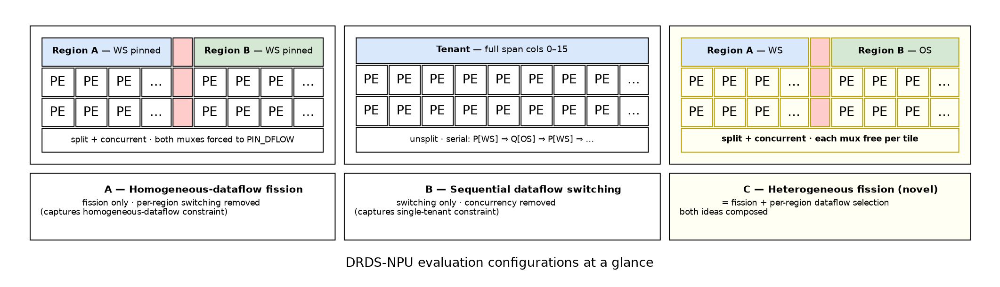
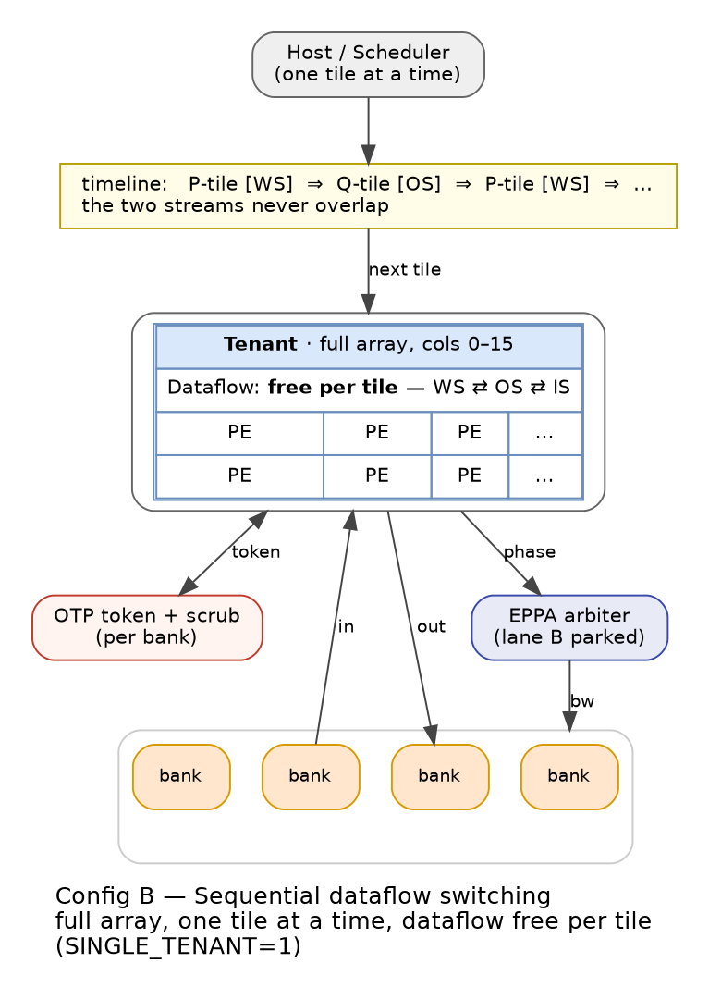

# DRDS-NPU Evaluation Framework — Idea-Level Comparison

**Document status:** Comparison methodology (Stage 1)
**Companion documents:**
`fission_baseline.md` (spatial fission + ownership safety)
`dataflow_switching_baseline.md` (runtime dataflow switching + EPPA)

---

## Table of Contents

- [0. Scope & Claims](#0-scope--claims)
- [1. Configurations](#1-configurations)
- [2. Realization Knobs](#2-realization-knobs)
- [3. Workloads](#3-workloads)
- [4. Metrics & Measurement Methodology](#4-metrics--measurement-methodology)
- [5. Hypotheses](#5-hypotheses)
- [6. Run Manifest](#6-run-manifest)
- [7. Result Templates](#7-result-templates)

---

## 0. Scope & Claims

This framework quantifies the **interaction between two architectural ideas** —
spatial fission and per-region dataflow selection — on a single RTL substrate.
It is an *architecture exploration* instrument, not a competition against
published systems.

**Claim discipline (binding for all results derived from this framework):**

1. **Single substrate.** All configurations execute the same RTL, same array,
   same int8 arithmetic, same tile definitions, same memory system. Fairness
   is guaranteed by construction: a comparison differs in exactly one knob.
2. **Degenerations, not replications.** Configurations A and B are the novel
   design with one idea disabled — they *capture the constraint* under which
   prior systems operate:
   - A captures the homogeneous-dataflow constraint described for Planaria
     (MICRO'20): every region must run the same dataflow.
   - B captures the sequential, single-tenant constraint described for ReDas
     (IEEE TC'24): dataflows may switch but only one model occupies the array.
   
   These papers are cited as **motivation for each configuration**, never as
   reproduced baselines. No result herein is a result about those systems.
3. **No superiority claims vs. published designs.** Absolute performance
   relative to Planaria/ReDas/HDA numbers is out of scope (no open
   implementations exist; substrate mismatch would invalidate any such
   comparison).
4. **Contribution shape.** The deliverable is a characterization: *when does
   per-region dataflow freedom pay on top of fission? when does concurrency
   pay on top of switching? and where does it not pay?* Negative regions
   (configurations or workloads where the combination does not help) are
   reported with equal standing.
5. **Terminology.** Results refer to "homogeneous-dataflow fission (A)",
   "sequential dataflow switching (B)", and "heterogeneous fission (C)".
   Paper names appear only in motivation sentences.

---

## 1. Configurations

### 1.1 The three-way matrix

| ID | Name | Array usage | Dataflow policy | Constraint captured |
|---|---|---|---|---|
| **A** | Homogeneous-dataflow fission | Split into 2 concurrent regions | **All regions pinned** to one global dataflow (`PIN_DFLOW`) | Fission without heterogeneity |
| **B** | Sequential dataflow switching | Full 16-column span, one tile at a time | Free WS/OS/IS per tile | Switching without concurrency |
| **C** | Heterogeneous fission (**novel**) | Split into 2 concurrent regions | Each region selects freely per tile | — |


*Figure 0 — A strips per-region switching, B strips concurrency, C composes both ideas.*

### 1.2 Configuration semantics

**Config A — homogeneous-dataflow fission.**
Fission machinery fully active (decoder, boundary isolation, OTP + scrub,
EPPA). `FORCE_DATAFLOW_EN = 1`: every region's effective `dataflow_mode` is
overridden by the global `PIN_DFLOW` register at every tile dispatch.
Primary variant: `PIN_DFLOW = WS` (the constraint prior multitasking designs
carry). Sensitivity variant: `PIN_DFLOW = OS`, used to show the penalty is
symmetric (pinning hurts whichever workload mismatches).


*Figure 1 — Config A: fission machinery fully active, both dataflow muxes pinned.*

**Config B — sequential dataflow switching.**
`SINGLE_TENANT = 1` (see `fission_baseline.md` §12): Region B's lane parks
(IDLE phase tag, no token requests), the decoder grants Region A the full
16-column span, and the scheduler issues tiles strictly serially. Dataflow is
chosen freely **per tile** — conv tiles run WS, attention tiles run OS — which
is precisely the capability-fraction of per-layer dataflow switching without
co-execution. Safety machinery stays active so that handover costs are
accounted identically across configs.


*Figure 2 — Config B: whole-array tenant, serialized tiles, free dataflow per tile.*

**Config C — heterogeneous fission.**
Both knobs off (`FORCE_DATAFLOW_EN = 0`, `SINGLE_TENANT = 0`). Two streams
co-execute on their own region spans; each region's controller selects its
dataflow per tile.


*Figure 3 — Config C (novel): concurrent regions with independent dataflow selection.*

### 1.3 Solo references (normalizers, not configurations)

Two additional runs establish per-stream best-case execution times used by the
weighted-speedup metric:

| ID | Definition |
|---|---|
| **S-P** | Stream P alone, full array, its optimal dataflow (WS) |
| **S-Q** | Stream Q alone, full array, its optimal dataflow (OS) |

Mechanically these are Config-B runs with a single stream; they exist to make
speedup normalization identical across all experiments.

### 1.4 Why degeneration beats replication here

Any faithful re-implementation of a published accelerator on this substrate
would be unfaithful by definition (different precision, array size, buffer
hierarchy, scheduler). Degeneration answers the exploration question
directly: subtracting one idea from C isolates that idea's marginal
contribution under otherwise identical conditions — something cross-paper
comparison cannot isolate even in principle.

---

## 2. Realization Knobs

| Knob | Level | Defined in | Values | Effect |
|---|---|---|---|---|
| `FORCE_DATAFLOW_EN` | Pod / region-controller boundary | `dataflow_switching_baseline.md` §12.1 | 0/1 | When 1, overrides every region's `dataflow_mode` |
| `PIN_DFLOW[1:0]` | Pod / region-controller boundary | `dataflow_switching_baseline.md` §12.1 | WS / OS (11 illegal) | Global pinned dataflow used when `FORCE_DATAFLOW_EN=1` |
| `SINGLE_TENANT` | Pod top level | `fission_baseline.md` §12.1 | 0/1 | Full-span single tenant; serialized dispatch; lane-B dormancy |

Configuration wiring:

| Config | `FORCE_DATAFLOW_EN` | `PIN_DFLOW` | `SINGLE_TENANT` |
|---|---|---|---|
| S-P / S-Q | 0 | — | 1 |
| A | 1 | WS (or OS) | 0 |
| B | 0 | — | 1 |
| C | 0 | — | 0 |

The knobs are orthogonal and dispatch-time stable (set before tile launch,
held through co-execution), consistent with the dispatch-time discipline of
both baseline documents.

---

## 3. Workloads

### 3.1 Tile primitives

All tiles are signed-int8 GEMMs `[M×K] · [K×N]` executed on one region span
(A/C) or the full span (B/solo). Two primitive types cover the dataflow
spectrum:

| Primitive | Shape (M×N×K) | Optimal dataflow | Memory phase profile |
|---|---|---|---|
| **P-tile** (conv-like) | 16 × 16 × 32 | WS (`00`) | `BURST` preload → `IDLE` compute → `BURST` drain |
| **Q-tile** (attention-like) | 16 × 16 × 32 | OS (`01`) | `STREAM` throughout |

Rationale: P has high weight reuse (weights loaded once per tile, activations
streamed) → weight-stationary wins. Q models `Q·Kᵀ` where both operands are
live activations and neither deserves residency → output-stationary wins.
Identical shapes are deliberate: any performance delta between configs is then
attributable to scheduling/dataflow policy, not workload size.

### 3.2 Workload set

Each stream = an ordered sequence of 6 tiles of one primitive type.

| ID | Name | Stream 1 | Stream 2 | Arrival | Purpose |
|---|---|---|---|---|---|
| **W1** | MIXED (primary) | P ×6 (WS-optimal) | Q ×6 (OS-optimal) | simultaneous | Core hypothesis test: heterogeneity value under fission |
| **W2** | HOMO-WS control | P ×6 | P ×6 | simultaneous | No-regression envelope: C must ≈ A-WS when heterogeneity is useless |
| **W3** | HOMO-OS control | Q ×6 | Q ×6 | simultaneous | Symmetric pin sensitivity: A-WS must suffer; A-OS ≈ C ≈ B-dataflow-wise |
| **W4** | STAGGERED | P ×6 | Q ×6 | Q dispatched when P completes layer 3 | Overlap/isolation dividend: late stream must not destroy early stream's progress |

Stagger rule (W4) is deterministic: dispatch event = completion of stream 1's
third tile. No other dynamic scheduling is permitted anywhere in the framework;
all remaining ordering is fixed by the workload tables above.

---

## 4. Metrics & Measurement Methodology

### 4.1 Timing events

Every simulation emits timestamped events to a CSV dump
(`tb/dumps/<run_id>.csv`). Event schema:

```
cycle, event_type, region, payload
```

Mandatory events:

| Event | Meaning |
|---|---|
| `DISPATCH` | Tile issued to a region/stream (payload: tile id) |
| `TILE_DONE` | Tile fully drained (payload: tile id) |
| `ALLOC_UPD` | EPPA allocation repinned (payload: new bw_alloc vector) |
| `SCRUB_START` / `ROLE_CLEAR` | Handover critical-section boundaries (payload: bank id) |
| `STALL` | Region had a pending tile but could not proceed (payload: cause) |
| `BYTES` | Bank bytes accepted (payload: bank, count) |

Stream completion time `T_X` = cycle of last `TILE_DONE` for stream X minus
its first `DISPATCH`.

### 4.2 Metric definitions

| Metric | Formula | Notes |
|---|---|---|
| Makespan | `T_total = max(T_P, T_Q)` (+ stagger offset for W4) | Primary wall-clock figure |
| Weighted speedup | `WS = T_P^S-P/T_P^cfg + T_Q^S-Q/T_Q^cfg` | Solo refs §1.3 normalize; `WS = 2` means both streams ran at solo speed simultaneously |
| Per-stream throughput | `tiles completed / (T_X / 1000)` | Layers per kilocycle |
| PE-cycle utilization | `U_PE = (c_A·n_A + c_B·n_B) / (256 · T_total)` | `c_X` = active MAC cycles, `n_X` = columns of region X |
| Bandwidth utilization | `U_BW = Σ bytes / (B_fabric · T_total)` | `B_fabric = NUM_BANKS × access width` bytes/cycle (nominal 32 B/cyc) |
| Stall cycles | `Σ STALL` per region, split by cause: `ST_BANK` (OTP/scrub/stale) vs `ST_BW` (allocation-starved) | Cause split attributes contention vs arbitration effects |
| Arbitration-event rate | `ALLOC_UPD count / (T_total/1000)` | Overhead + timing-surface proxy (secondary) |
| Handover amortization | `Σ (ROLE_CLEAR − SCRUB_START + 1) / T_total` | Fraction of runtime spent in scrub critical sections |

`ST_DEP` (structural dependency stalls) may occur in B/solo runs by
construction of serialization; it is reported but excluded from
efficiency discussion.

### 4.3 Statistical protocol

RTL execution is deterministic given inputs; variance comes from memory
request interleaving. Protocol: 5 randomized request-timing seeds per run;
report **median** with min/max whiskers. All 5 seeds share the identical
workload tables of §3. A seed changes only the relative arrival skew of bank
requests within a phase, never phases themselves.

### 4.4 Instrumentation requirements

Monitors live in testbench land (no RTL impact): column activity counters,
bank byte counters, stall detectors at region sequencers, event logger.
Golden outputs are checked first — **a run with any functional mismatch is
discarded regardless of its metrics** (correctness gates V1–V9 /
W1–W11 remain prerequisites).

---

## 5. Hypotheses

Exploration-style: each hypothesis states what outcome *supports* the idea's
value and what outcome *refutes* it. Refutations are reported as findings.

| ID | Statement | Experiment | Supports if | Refutes if |
|---|---|---|---|---|
| **H1** | Per-region dataflow freedom pays on top of fission | W1: C vs A-WS | `WS(C) > WS(A-WS)` beyond seed noise | `WS(C) ≤ WS(A-WS)` |
| **H2** | Concurrency pays on top of switching | W1/W4: C vs B | `WS(C) > WS(B)`; margin grows with stream independence | `WS(C) ≤ WS(B)` |
| **H3** | Heterogeneity costs nothing when unneeded | W2: C vs A-WS | `WS(C) ≈ WS(A-WS)` within noise | Significant regression of C on homogeneous pairs |
| **H4** | Wrong-pin penalty is symmetric | W3 vs W1 | A-WS ≈ C on W3 while A-OS ≈ C; A-WS ≪ C on W3 | Penalty asymmetric without structural cause |
| **H5** | Fission isolates tenants under staggered arrival | W4: C vs B | Early stream's per-tile times unchanged after Q arrives in C; B serializes by construction | Early-stream slowdown > small bounded factor in C |
| **H6** | A contention-dominated negative region exists | Any workload with saturated `U_BW` | Documented regime where `WS(B) ≥ WS(C)` | — (characterization finding either way) |

H6 is included deliberately: an exploration paper that reports *where the
combination stops helping* is more defensible than one reporting uniform
wins. Expected candidate regime: both streams streaming-heavy (W3-like) at
high arrival overlap, where bandwidth, not dataflow, is the binding resource.

---

## 6. Run Manifest

18 simulations total: 2 solo references + 4 workloads × 4 configurations.

| Run ID | Config | Workload | Purpose |
|---|---|---|---|
| `S-P` | B-machinery, single stream | P ×6 | Normalizer (WS optimal) |
| `S-Q` | B-machinery, single stream | Q ×6 | Normalizer (OS optimal) |
| `W1-A-WS` | A (`PIN=WS`) | W1 | H1 baseline |
| `W1-A-OS` | A (`PIN=OS`) | W1 | Pin-sensitivity contrast |
| `W1-B` | B | W1 | H2 baseline |
| `W1-C` | C | W1 | H1/H2 subject |
| `W2-A-WS` | A (`PIN=WS`) | W2 | H3 |
| `W2-C` | C | W2 | H3 |
| `W3-A-WS` | A (`PIN=WS`) | W3 | H4 |
| `W3-A-OS` | A (`PIN=OS`) | W3 | H4 |
| `W3-B` | B | W3 | Context |
| `W3-C` | C | W3 | H4 |
| `W4-A-WS` | A (`PIN=WS`) | W4 | Isolation contrast |
| `W4-B` | B | W4 | H5 baseline |
| `W4-C` | C | W4 | H5 subject |
| `W2-B`, `W4-A-OS` | — | — | Optional completeness slots |
| `W1-*` extra seeds ×5 | — | — | §4.3 protocol |

Runs marked optional may be dropped if budget-bound without affecting any
hypothesis; all others are required.

---

## 7. Result Templates

### T1 — Headline summary (one row per config, per workload)

| Workload | Config | T_total (cyc) | WS | U_PE | U_BW | Stall_bank | Stall_bw | Arb events/kc |
|---|---|---|---|---|---|---|---|---|
| W1 | A-WS | | | | | | | |
| W1 | A-OS | | | | | | | |
| W1 | B | | | | | | | |
| W1 | C | | | | | | | |

*(replicate block per workload)*

### T2 — Hypothesis scorecard

| Hypothesis | Verdict (supported / refuted) | Evidence (run IDs) | Margin (median, min–max) |
|---|---|---|---|
| H1 | | | |
| H2 | | | |
| H3 | | | |
| H4 | | | |
| H5 | | | |
| H6 | | | |

### T3 — Interaction summary (the exploration paper's core table)

| Comparison | Isolates | Δ weighted speedup (C over X) | Interpretation |
|---|---|---|---|
| C − A-WS | Value of per-region dataflow freedom under fission | | |
| C − B | Value of spatial concurrency under free switching | | |
| A-WS − A-OS | Direction sensitivity of homogeneous pinning | | |

---

*DRDS-NPU Evaluation Framework · Idea-level comparison · One substrate, three configurations, zero replicated papers*
